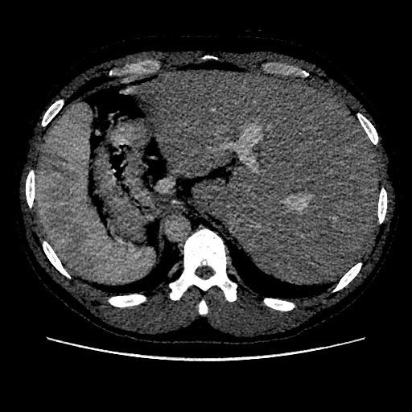
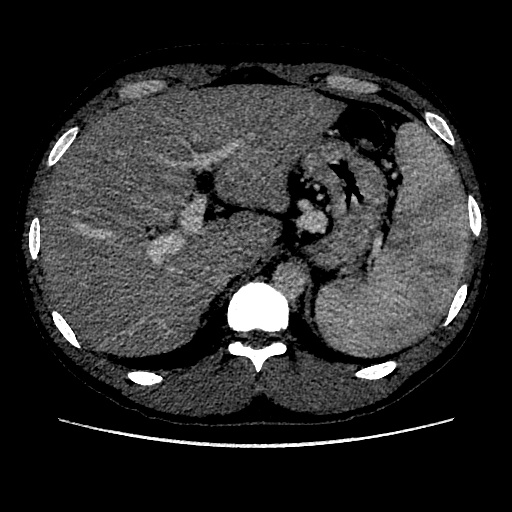
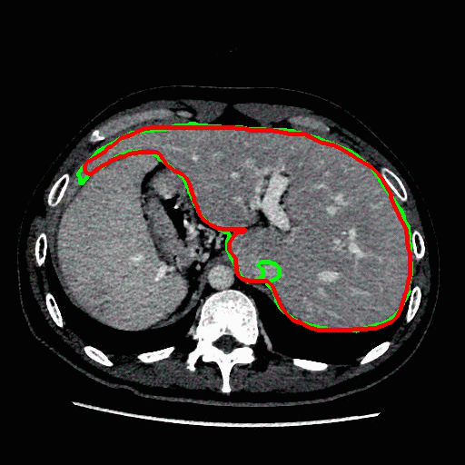

# Medical images segmentation, using U-NET in Keras


---

## Overview
I choose a function based on a calculation process
of dice_coef as the model 's loss fuction.

### Data

There are two  folders , named '**liver**' and '**spleen**',  which contains an example data and label for liver and spleen. The Computed Tomography images are saved at '**../img**' ,where the masked images(label) are saved at '**../cls**' ,for each samples , the file name in '**../img**' and '**../cls**' should be same.

### data augumentation
I used opencv in python interface library to finish the data augumentation before training,and these step needs a lot of memory.
There is an effect in **load\_images.ipynb**

### An example of data
liver origin image:



spleen origin image::



### A quick look of the resut of this trained model



I  compose some results of my training data into a gif in '**./img**'. The red line is masked by expert where the green line is predicted by model.


---

## How to use


This tutorial depends on the following libraries:

* Python 3.5.3
* jupyter-client (5.0.0)
* notebook (4.4.1)
* tensorflow (1.4.0)
* Keras (2.1.4)
* matplotlib (2.0.0)
* opencv-python (3.3.1+contrib)
* SimpleITK (1.0.1)
* numpy (1.14.1)

### main\_train\_test.py

This program is the main scrpts of my code. It will load the data and label from the folder that you designate(liver or spleen), after data augumentation it will begin training. You can see the effect in **main\_train\_test.ipynb**

### unet.py
A package of the code that builds the structure of U-net

### read\_nii.py
This program is used for data preprocessing,makes the nii format images from different folders transform  to jpg format using SimpleITK in python, and put the data into a folder.

### imgnet\_model\_test.py

This program is used to show the method of segmentation and  the segment result for all images in a folder.

### imgnet\_predict.py

This program is used to show the method of segmentation and  the segment result for single images.


### Running

```
python main_train_test.py
```

##References：


[1] O. Ronneberger, P. Fischer, T. Brox. U-Net: Convolutional Networks for Biomedical Image Segmentation. In Medical Image Computing and Computer-Assisted Intervention (MICCAI), Springer, LNCS, Vol.9351: 234--241, 2015
[2] zhixuhao. “zhixuhao/unet.” Github. Github, 6 Apr 2017. Web,24 Oct 2017


##Contact me：

<bohrium.kwong@gmail.com>
